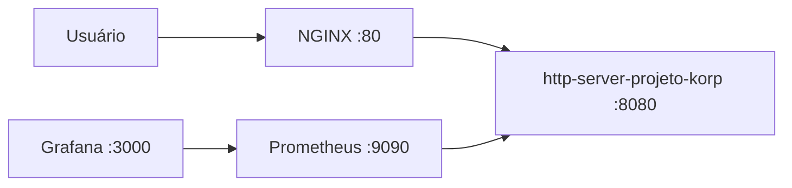
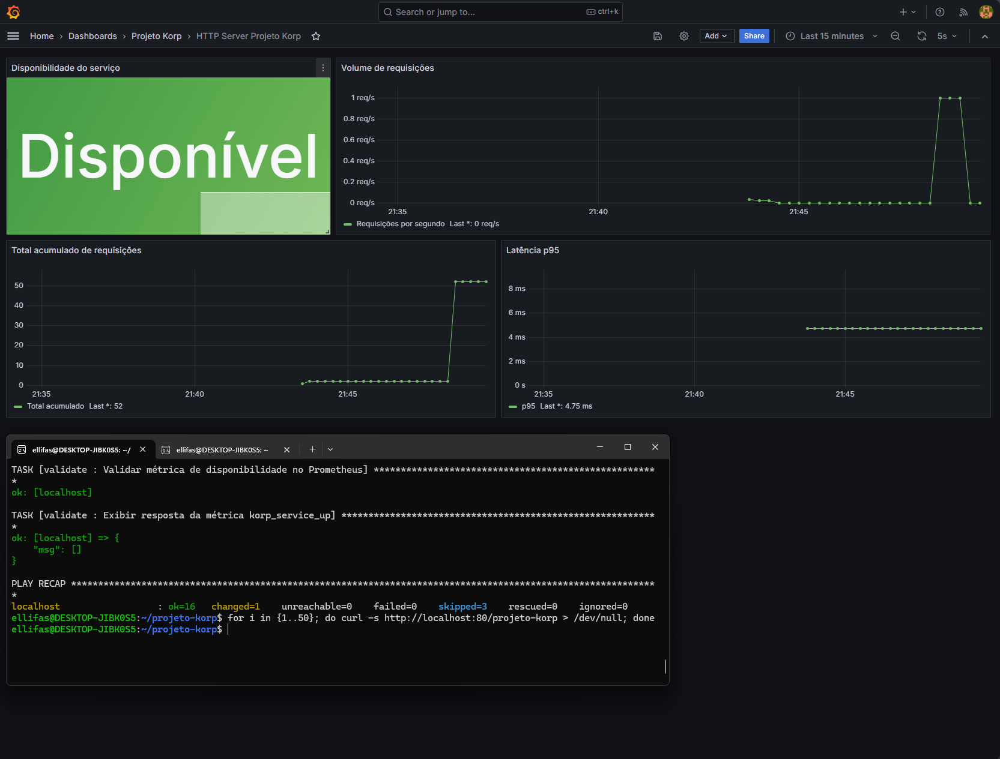

# Projeto Korp — HTTP Server com Go, Docker, NGINX, Prometheus, Grafana e Ansible

Projeto desenvolvido para o desafio técnico da Korp, com foco em programação Go, Docker, redes, proxy reverso, observabilidade com Prometheus/Grafana e automação de ambiente Linux com Ansible.

## Objetivo

Implementar um serviço HTTP em Golang chamado `http-server-projeto-korp`, exposto internamente na porta `8080`, acessível externamente via NGINX na porta `80`, com métricas no padrão Prometheus e dashboard provisionado automaticamente no Grafana.

O endpoint principal é:

```http
GET /projeto-korp
```

Resposta esperada:

```json
{
  "nome": "Projeto Korp",
  "horario": "2026-05-27T12:00:00Z"
}
```

O campo `horario` é gerado dinamicamente a cada requisição em UTC.

## Arquitetura



## Tecnologias utilizadas

- Go
- Docker
- Docker Compose
- NGINX
- Prometheus
- Grafana
- Ansible
- GitHub Actions

## Estrutura do projeto

```text
projeto-korp/
├── cmd/
│   └── server/
│       └── main.go
├── internal/
│   └── handler/
│       ├── projeto_korp.go
│       └── projeto_korp_test.go
├── nginx/
│   └── http-server-projeto-korp.conf
├── prometheus/
│   └── prometheus.yml
├── grafana/
│   └── provisioning/
├── ansible/
│   ├── inventory.ini
│   ├── playbook.yml
│   ├── requirements.yml
│   └── roles/
├── Dockerfile
├── docker-compose.yml
├── Makefile
└── README.md
```

## Como executar com Ansible

Instale a collection necessária:

```bash
ansible-galaxy collection install -r ansible/requirements.yml
```

Execute o provisionamento completo:

```bash
ansible-playbook -i ansible/inventory.ini ansible/playbook.yml -K
```

O parâmetro `-K` solicita a senha de sudo para as etapas que precisam de privilégio administrativo.

## Como executar manualmente com Docker Compose

Crie a rede Docker:

```bash
docker network create korp-network
```

Suba os containers:

```bash
docker compose up -d --build
```

Verifique os containers:

```bash
docker compose ps
```

## Como testar o serviço

Endpoint principal:

```bash
curl http://localhost:80/projeto-korp
```

Healthcheck:

```bash
curl http://localhost:80/healthz
```

Métrica de disponibilidade:

```bash
curl "http://localhost:9090/api/v1/query?query=korp_service_up"
```

Consulta de métricas expostas pela aplicação:

```bash
docker exec prometheus-projeto-korp wget -qO- "http://http-server-projeto-korp:8080/metrics" | grep korp
```

## Métricas implementadas

### Disponibilidade do serviço

```promql
korp_service_up
```

Indica se o serviço está disponível.

Valor esperado:

```text
1
```

### Volume de requisições

```promql
rate(korp_requests_total[1m])
```

Indica a taxa de requisições recebidas pelo endpoint `/projeto-korp`.

### Total acumulado de requisições

```promql
korp_requests_total
```

Indica o total acumulado de requisições processadas.

### Latência p95

```promql
histogram_quantile(0.95, rate(korp_request_duration_seconds_bucket[5m]))
```

Indica o percentil 95 da duração das requisições.

## Grafana

Acesse:

```text
http://localhost:3000
```

Credenciais padrão:

```text
Usuário: admin
Senha: admin
```

Dashboard provisionado automaticamente:

```text
Dashboards > Projeto Korp > HTTP Server Projeto Korp
```

Painéis disponíveis:

- Disponibilidade do serviço
- Volume de requisições
- Total acumulado de requisições
- Latência p95

## Screenshot do Dashboard Grafana



## Comandos úteis com Makefile

Executar testes:

```bash
make test
```

Subir ambiente:

```bash
make up
```

Derrubar ambiente:

```bash
make down
```

Provisionar via Ansible:

```bash
make ansible
```

Ver containers:

```bash
make ps
```

Ver logs:

```bash
make logs
```

## Decisões técnicas

- A aplicação foi implementada com `net/http`, mantendo o serviço simples, performático e com poucas dependências.
- O NGINX atua como ponto único de entrada, evitando exposição direta da aplicação ao host.
- O serviço Go expõe métricas no padrão Prometheus através do endpoint `/metrics`.
- O Prometheus coleta métricas diretamente do container da aplicação pela rede Docker interna.
- O Grafana é provisionado automaticamente com datasource e dashboard, garantindo reprodutibilidade.
- O Ansible foi dividido em roles para separar responsabilidades: Docker, rede, aplicação e validação.
- A imagem Docker utiliza multi-stage build para separar build e runtime.
- O container da aplicação executa com usuário não-root, melhorando a segurança do runtime.

## Troubleshooting

### Porta 80 já está em uso

Verifique o processo usando a porta:

```bash
sudo lsof -i :80
```

Finalize o processo ou altere o mapeamento de porta no `docker-compose.yml`.

### Docker não responde no WSL

Verifique se o Docker Desktop está aberto no Windows e se a integração com WSL está habilitada.

No Docker Desktop:

```text
Settings > Resources > WSL Integration
```

### Recriar ambiente do zero

```bash
make clean
make up
```

### Dashboard não apareceu no Grafana

Recrie o container do Grafana:

```bash
docker compose up -d --force-recreate grafana
```

## Validação final esperada

```bash
curl http://localhost:80/projeto-korp
```

Resposta esperada:

```json
{
  "nome": "Projeto Korp",
  "horario": "2026-05-27T12:00:00Z"
}
```

```bash
curl "http://localhost:9090/api/v1/query?query=korp_service_up"
```

Resultado esperado:

```json
{
  "status": "success"
}
```
